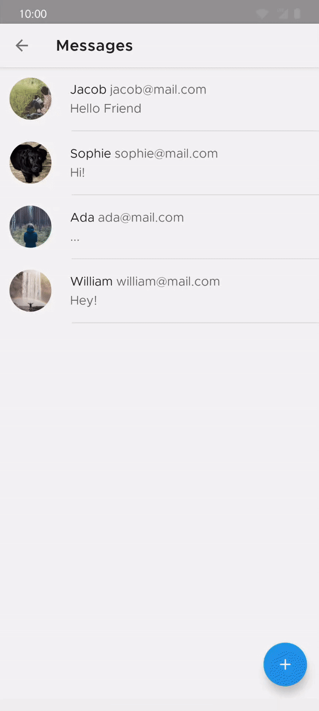

<h1 align="center">Material Motion Samples</h1> 

<h5 align="center">
A collection of samples using Material Components Transitions for Android
</h5>

<h2>Messages</h2>

It implements an expanded FAB transition to transform the FAB into a menu with related actions. It uses the [Material Container Transform](https://material.io/design/motion/the-motion-system.html#container-transform) transition to transform a view.

<h2 align="left">Solar system</h2>

A Material Stepper using [Shared Axis](https://material.io/design/motion/the-motion-system.html#shared-axis) pattern. The transition is made on the Y axis in two directions depending on the step that is clicked.

<h2 align="left">Music</h2>

...
