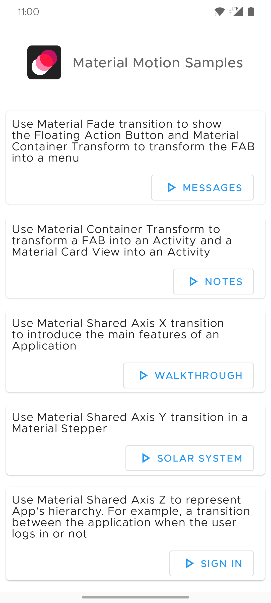
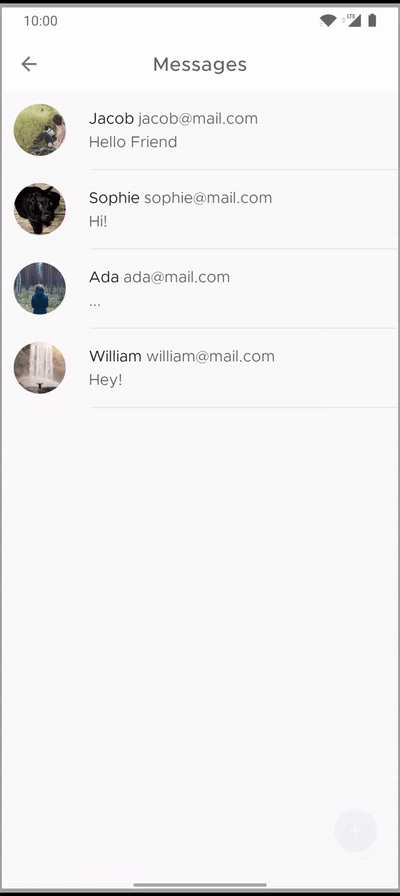
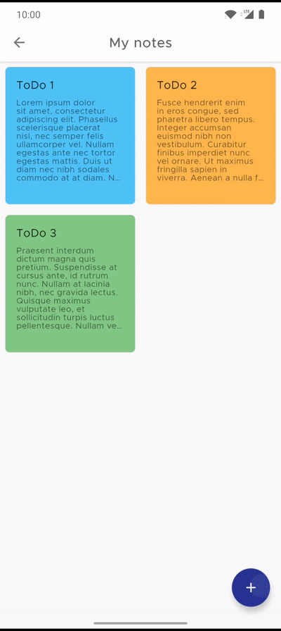
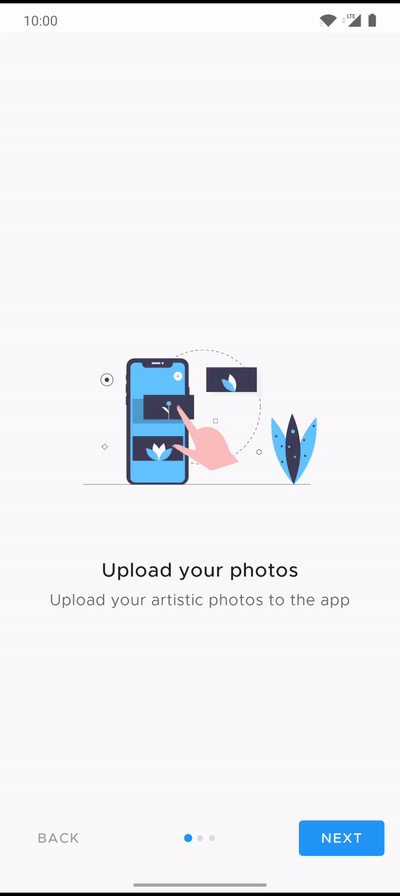
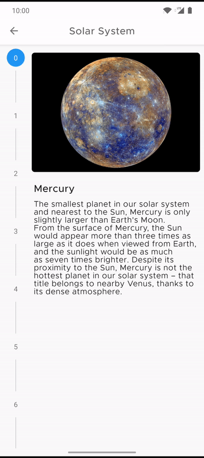
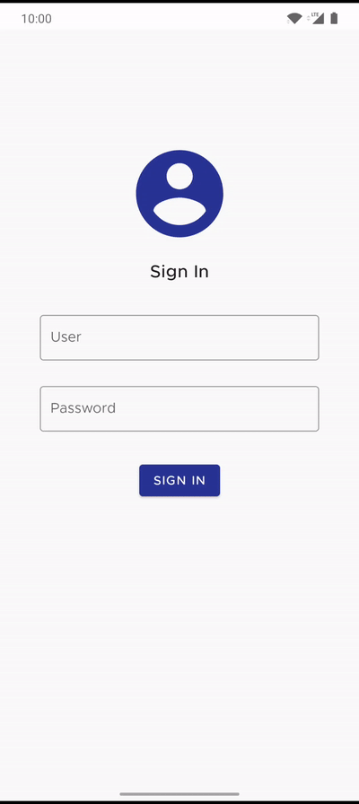
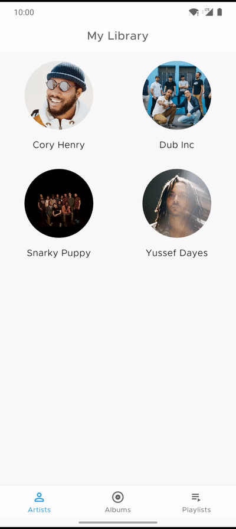
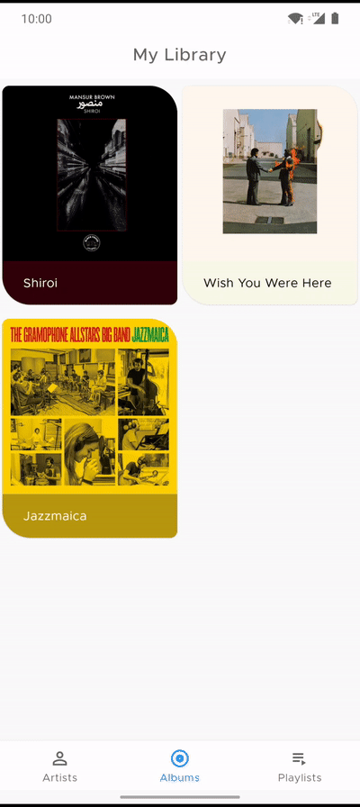

<h1 align="center">Material Motion Samples</h1> 

<h5 align="center">
A collection of samples using Material Components Transitions for Android
</h5>

<h2>Messages</h2>

Use Material Fade transition to show the Floating Action Button and Material Container Transform to transform the FAB into a menu

  
  

<h2>Notes</h2>

Use Material Container Transform to transform a FAB into an Activity and a Material Card View into an Activity

  

<h2>Walkthrough</h2>

Use Material Shared Axis X transition to introduce the main features of an Application

  

<h2>Solar System</h2>

Use Material Shared Axis Y transition in a Material Stepper

  

<h2>Sign In</h2>

Use Material Shared Axis Z to represent App's hierarchy. For example, a transition between the application when the user logs in or not

  

<h2>Music</h2>

Use Material Fade Through to switch between views that do not have a strong relationship to each other and Material Container Transform with Android Navigation Component

  
  

